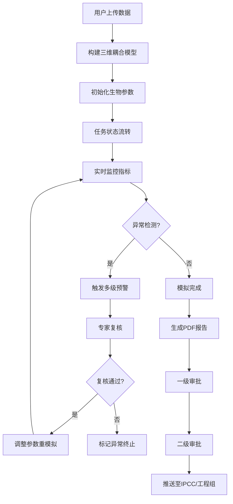

## 1. 产品概述
高分辨率海洋生物地球化学循环与碳汇智能评估平台，为海洋科学家和气候政策制定者提供一体化的海洋碳循环模拟、分析与决策支持系统。通过整合全球海洋环流模式数据与现场观测数据，自动构建三维物理-生物地球化学耦合模型，实现高精度的海洋碳汇评估与预警。

- **核心价值**：提升海洋碳汇评估的准确性与效率，支撑IPCC气候评估与海洋负排放工程决策
- **目标用户**：海洋生物地球化学家、碳收支专家、气候政策制定者、海洋负排放工程团队
- **解决问题**：传统海洋碳汇模拟流程繁琐、参数调整依赖经验、异常响应滞后、报告生成效率低

## 2. 核心功能

### 2.1 用户角色与权限
| 角色 | 注册方式 | 核心权限 |
|------|----------|----------|
| 海洋生物地球化学家 | 邀请注册 | 上传数据、创建模拟任务、复核预警、调整生物参数 |
| 碳收支专家 | 邀请注册 | 审批模拟结果、验证生物过程合理性、确认碳收支数据 |
| 首席科学家 | 邀请注册 | 查看所有任务、接收异常通知、审批海盆恢复 |
| 系统管理员 | 系统分配 | 用户管理、系统配置、数据备份 |
| IPCC评估小组 | 只读授权 | 查看已通过的模拟结果和碳汇评估报告 |
| 海洋负排放工程组 | 只读授权 | 查看相关海盆的碳汇数据与模拟结果 |

### 2.2 功能模块清单
1. **数据上传页面**：支持全球海洋环流模式输出、营养盐、浮游植物、溶解氧等多源数据上传
2. **模拟任务管理页面**：任务列表、状态流转可视化、任务详情、参数调整日志
3. **实时监控中心**：表层叶绿素浓度、真光层深度、缺氧区面积实时监控曲线
4. **预警管理页面**：多级预警列表、预警详情、专家复核界面
5. **智能推荐引擎**：最优参数化方案推荐、历史模拟数据分析
6. **审批流程页面**：两级审批工作台、审批历史、审批意见管理
7. **报告生成中心**：PDF综合报告生成、数据导出、碳汇统计
8. **性能看板页面**：全天候性能监控、碳泵效率雷达图、每日统计报表

### 2.3 页面详情
| 页面名称 | 模块名称 | 功能描述 |
|----------|----------|----------|
| 数据上传页面 | 数据上传组件 | 支持NetCDF、CSV、Excel格式，拖拽上传，上传进度显示，数据校验 |
| 数据上传页面 | 参数初始化配置 | 生物参数（生长率、死亡率、沉降速率）自动计算与手动调整 |
| 数据上传页面 | 模型构建预览 | 三维网格可视化、耦合模型配置预览 |
| 模拟任务管理 | 任务状态流转图 | 待校验→数据融合→网格初始化→生物化学迭代→碳通量计算→完成，异常回退可视化 |
| 模拟任务管理 | 任务列表 | 分页、筛选、搜索、批量操作 |
| 模拟任务管理 | 任务详情面板 | 参数配置、运行日志、中间结果查看 |
| 实时监控中心 | 多指标监控面板 | 叶绿素浓度、真光层深度、缺氧区面积实时曲线图 |
| 实时监控中心 | 预警阈值配置 | 缺氧区扩张速率阈值、初级生产力骤降阈值设置 |
| 预警管理页面 | 预警列表 | 按级别、状态、时间筛选，预警详情查看 |
| 预警管理页面 | 专家复核工作台 | 预警数据查看、复核意见填写、参数调整建议 |
| 预警管理页面 | 重模拟触发 | 复核通过后自动触发参数调整与重新模拟 |
| 智能推荐引擎 | 参数推荐面板 | 基于历史模拟推荐最优POC沉降速度、再矿化深度等 |
| 智能推荐引擎 | 推荐历史 | 推荐方案采纳率、效果评估 |
| 审批流程页面 | 待审批列表 | 一级、二级待审批任务分类展示 |
| 审批流程页面 | 审批工作台 | 生物过程合理性验证、碳收支数据确认 |
| 审批流程页面 | 审批历史 | 所有审批记录、意见、时间追踪 |
| 报告生成中心 | 报告模板配置 | 碳通量时空分布图、营养盐断面、群落演替、氧气最小带演化 |
| 报告生成中心 | 数据导出 | 按海盆、季节、排放情景导出碳汇数据和生物量统计 |
| 性能看板页面 | 关键指标卡片 | 模拟完成率、预警响应时间、碳汇评估精度 |
| 性能看板页面 | 碳泵效率雷达图 | 物理泵、生物泵、碳酸盐泵多维度效率展示 |
| 性能看板页面 | 每日统计报表 | 日、周、月维度统计数据可视化 |

## 3. 核心流程

### 3.1 模拟任务主流程
用户上传海洋环流模式输出和观测数据 → 系统自动构建三维物理-生物地球化学耦合模型 → 自动初始化生物参数（生长率、死亡率、沉降速率）→ 任务状态自动流转（待校验→数据融合→网格初始化→生物化学迭代→碳通量计算→完成）→ 实时监控关键指标 → 异常触发预警 → 专家复核 → 调整参数重新模拟 → 模拟完成 → 生成PDF报告 → 两级审批 → 推送至IPCC和工程组

### 3.2 异常预警流程
计算中实时监控表层叶绿素浓度、真光层深度和缺氧区面积 → 检测缺氧区扩张速率超过历史均值两倍或初级生产力骤降 → 自动触发多级预警 → 推送至海洋生物地球化学家 → 专家复核 → 复核通过 → 自动调整浮游植物功能群参数或沉降速率 → 重新模拟 → 记录调整日志

### 3.3 审批推送流程
模拟完成生成报告 → 海洋生物地球化学家验证生物过程合理性（一级审批）→ 提交碳收支专家确认（二级审批）→ 审批通过 → 自动推送至IPCC评估小组和海洋负排放工程组

### 3.4 海盆异常暂停流程
系统监控同一海盆连续模拟结果 → 检测连续三次净初级生产力偏差超过20% → 自动暂停该海盆新任务 → 通知首席科学家 → 排查原因 → 首席科学家审批恢复

## 4. 用户界面设计

### 4.1 设计风格
- **主色调**：深海蓝（#0A2463）为主色调，海洋青（#3E92CC）为辅助色，珊瑚橙（#F46036）为预警色，海藻绿（#1B998B）为成功色
- **中性色**：使用slate系列灰度，营造专业科研氛围
- **按钮风格**：圆角8px，微妙阴影，hover时有上浮效果，disabled状态半透明
- **字体**：标题使用Playfair Display（优雅学术感），正文使用Inter（清晰易读），等宽数据显示使用JetBrains Mono
- **布局风格**：左侧固定导航侧边栏 + 顶部状态栏 + 主内容区卡片式布局，数据密集型页面采用dashboard网格布局
- **图标**：使用lucide-react图标库，统一线性风格，大小16-20px
- **数据可视化**：使用ECharts绘制专业科学图表，支持交互、缩放、导出

### 4.2 页面设计概述
| 页面名称 | 模块名称 | UI元素 |
|----------|----------|--------|
| 数据上传页面 | 上传区域 | 大尺寸拖拽区域，渐变边框，hover时发光效果，文件列表卡片式展示 |
| 数据上传页面 | 参数配置 | 分组表单，滑块控件，数值输入框带单位，实时预览参数分布直方图 |
| 模拟任务管理 | 状态流转图 | 水平时间轴样式，节点使用不同颜色状态标记，连接线动画，点击节点查看详情 |
| 模拟任务管理 | 任务列表 | 表格+卡片双视图切换，行悬停高亮，状态标签圆角胶囊样式 |
| 实时监控中心 | 监控图表 | 三栏等高布局，每个图表带标题、单位、最新值卡片，支持全屏查看 |
| 实时监控中心 | 预警指示器 | 右上角悬浮预警计数，红橙黄三级颜色编码，点击展开预警列表 |
| 预警管理页面 | 预警卡片 | 时间线布局，预警级别颜色边框，关键指标高亮，复核状态标记 |
| 智能推荐引擎 | 参数推荐 | 卡片式推荐方案，置信度进度条，对比基线参数差异，采纳按钮 |
| 审批流程页面 | 审批工作台 | 左右分栏，左侧待办列表，右侧详情面板，审批操作按钮固定底部 |
| 性能看板页面 | 雷达图 | 中心碳泵效率雷达图，周围环绕关键指标卡片，底部时间趋势图 |
| 性能看板页面 | 统计报表 | 数据表格带条件格式化，超阈值单元格标红，支持导出Excel |

### 4.3 响应式设计
- **桌面端优先**：针对1920×1080及以上分辨率优化，支持4K显示
- **平板适配**：侧边栏可折叠，图表自适应宽度
- **移动端**：简化布局，重点数据卡片展示，操作功能降级为查看模式
- **触控优化**：可点击区域不小于44×44px，滑动手势支持图表缩放

### 4.4 数据可视化指导
- **三维海洋可视化**：使用WebGL绘制全球海洋温度、盐度、碳通量的三维等值面
- **地图投影**：支持多种地图投影（等距圆柱、墨卡托、极地立体）
- **断面图**：沿经度/纬度的营养盐、溶解氧垂直断面彩色填充图
- **时间序列**：多曲线对比图，支持区域选择放大
- **动画**：碳通量季节变化、缺氧区扩张的时间序列动画
