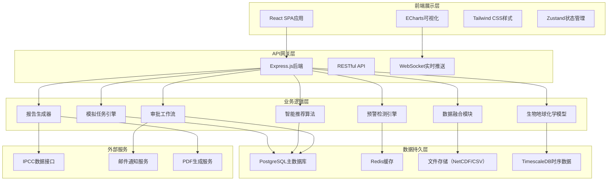
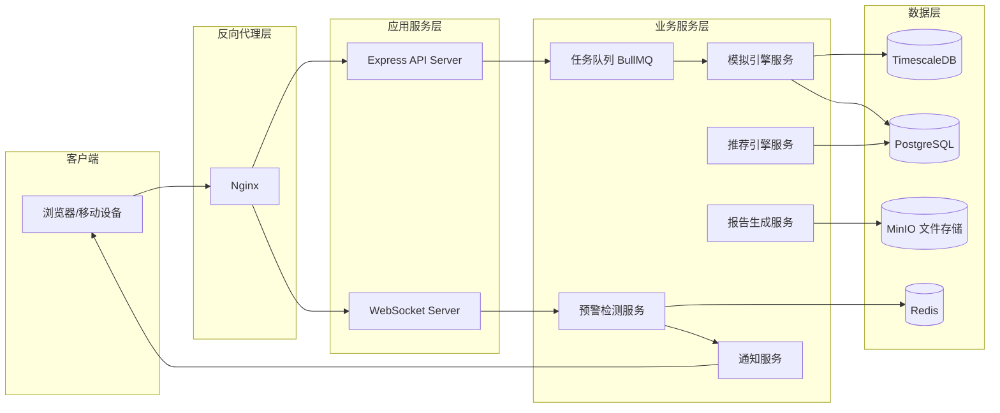
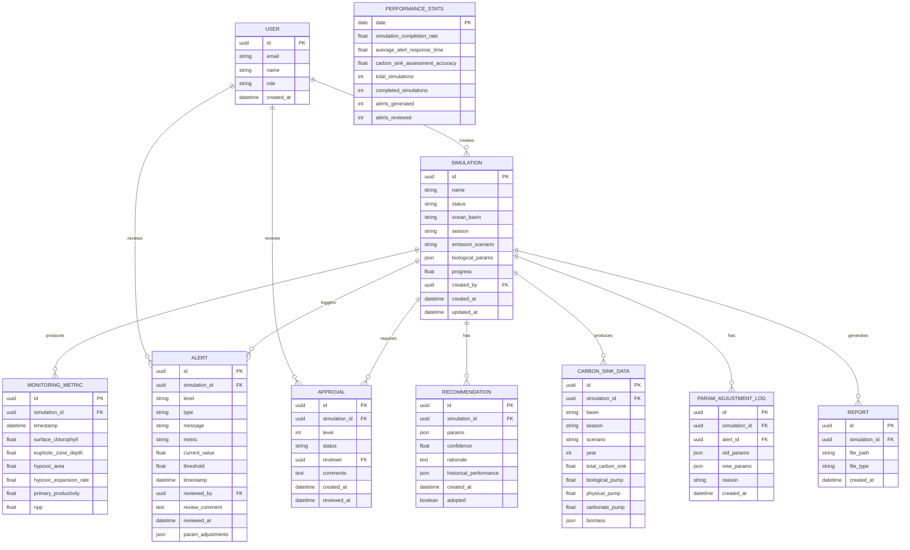

## 1. 架构设计



## 2. 技术描述

### 2.1 技术栈选型
- **前端**：React@18.2.0 + TypeScript@5.0 + Vite@5.0
- **样式系统**：Tailwind CSS@3.4 + CSS变量主题系统
- **状态管理**：Zustand@4.5
- **路由管理**：React Router Dom@6.20
- **数据可视化**：ECharts@5.4 + @react-three/fiber（三维可视化）
- **UI组件库**：lucide-react@0.294（图标）+ shadcn/ui组件
- **后端**：Express@4.18 + TypeScript@5.0
- **数据库**：PostgreSQL@15（主数据）+ Redis@7.2（缓存/消息队列）
- **API文档**：Swagger/OpenAPI
- **实时通信**：Socket.io@4.7
- **数据处理**：csv-parser + netcdf-js（科学数据解析）
- **PDF生成**：jspdf@2.5 + html2canvas
- **测试**：Vitest + React Testing Library

### 2.2 核心技术决策
1. **React + TypeScript**：保证类型安全，适合复杂科学计算应用
2. **Zustand**：轻量级状态管理，避免Redux的复杂性
3. **ECharts**：功能强大的科学图表库，支持海洋数据可视化
4. **Tailwind CSS**：快速构建一致的UI，支持响应式设计
5. **Express + TypeScript**：轻量级后端，快速API开发
6. **PostgreSQL + TimescaleDB**：高效存储时序海洋观测数据
7. **Redis**：实时监控数据缓存和任务队列管理

## 3. 路由定义

| 路由路径 | 页面名称 | 权限要求 |
|----------|----------|----------|
| /dashboard | 性能看板首页 | 所有登录用户 |
| /data-upload | 数据上传 | 海洋生物地球化学家+ |
| /simulations | 模拟任务管理 | 海洋生物地球化学家+ |
| /simulations/:id | 模拟任务详情 | 海洋生物地球化学家+ |
| /monitoring | 实时监控中心 | 海洋生物地球化学家+ |
| /alerts | 预警管理 | 海洋生物地球化学家+ |
| /recommendations | 智能推荐引擎 | 海洋生物地球化学家+ |
| /approvals | 审批工作台 | 审批人角色 |
| /reports | 报告生成中心 | 海洋生物地球化学家+ |
| /settings | 系统设置 | 系统管理员 |
| /login | 登录页面 | 公开 |

## 4. API定义

### 4.1 TypeScript类型定义

```typescript
// 模拟任务状态枚举
export enum SimulationStatus {
  PENDING_VALIDATION = 'pending_validation',
  DATA_FUSION = 'data_fusion',
  GRID_INITIALIZATION = 'grid_initialization',
  BIOGEOCHEMICAL_ITERATION = 'biogeochemical_iteration',
  CARBON_FLUX_CALCULATION = 'carbon_flux_calculation',
  COMPLETED = 'completed',
  ERROR = 'error',
  ROLLBACK = 'rollback'
}

// 预警级别
export enum AlertLevel {
  INFO = 'info',
  WARNING = 'warning',
  CRITICAL = 'critical'
}

// 审批状态
export enum ApprovalStatus {
  PENDING = 'pending',
  APPROVED = 'approved',
  REJECTED = 'rejected'
}

// 生物参数
export interface BiologicalParams {
  growthRate: number;           // 生长率 (d⁻¹)
  mortalityRate: number;        // 死亡率 (d⁻¹)
  sinkingRate: number;          // 沉降速率 (m d⁻¹)
  pocSinkingVelocity: number;   // 颗粒有机碳沉降速度 (m d⁻¹)
  remineralizationDepth: number;// 再矿化深度 (m)
}

// 模拟任务
export interface Simulation {
  id: string;
  name: string;
  description: string;
  oceanBasin: string;
  season: string;
  emissionScenario: string;
  status: SimulationStatus;
  params: BiologicalParams;
  progress: number;
  createdAt: string;
  updatedAt: string;
  createdBy: string;
  alertCount: number;
  nppDeviation: number;
}

// 监控指标
export interface MonitoringMetrics {
  timestamp: string;
  simulationId: string;
  surfaceChlorophyll: number;      // 表层叶绿素浓度 (mg m⁻³)
  euphoticZoneDepth: number;       // 真光层深度 (m)
  hypoxicArea: number;             // 缺氧区面积 (km²)
  hypoxicExpansionRate: number;    // 缺氧区扩张速率 (% d⁻¹)
  primaryProductivity: number;     // 初级生产力 (mg C m⁻² d⁻¹)
  npp: number;                     // 净初级生产力 (Pg C yr⁻¹)
}

// 预警信息
export interface Alert {
  id: string;
  simulationId: string;
  level: AlertLevel;
  type: string;
  message: string;
  metric: string;
  currentValue: number;
  threshold: number;
  timestamp: string;
  reviewedBy: string | null;
  reviewComment: string | null;
  reviewedAt: string | null;
  paramAdjustments: Partial<BiologicalParams> | null;
}

// 审批记录
export interface Approval {
  id: string;
  simulationId: string;
  level: number; // 1 or 2
  status: ApprovalStatus;
  reviewer: string;
  comments: string;
  createdAt: string;
  reviewedAt: string | null;
}

// 推荐方案
export interface Recommendation {
  id: string;
  simulationId: string;
  params: Partial<BiologicalParams>;
  confidence: number;
  rationale: string;
  historicalPerformance: {
    nppImprovement: number;
    rmseReduction: number;
  };
  createdAt: string;
  adopted: boolean;
}

// 碳汇数据
export interface CarbonSinkData {
  basin: string;
  season: string;
  scenario: string;
  year: number;
  totalCarbonSink: number;      // 总碳汇 (Tg C yr⁻¹)
  biologicalPump: number;       // 生物泵效率 (Pg C yr⁻¹)
  physicalPump: number;         // 物理泵效率 (Pg C yr⁻¹)
  carbonatePump: number;        // 碳酸盐泵效率 (Pg C yr⁻¹)
  biomass: {
    phytoplankton: number;      // 浮游植物生物量 (mg C m⁻³)
    zooplankton: number;        // 浮游动物生物量 (mg C m⁻³)
    bacteria: number;           // 细菌生物量 (mg C m⁻³)
  };
}

// 性能统计
export interface PerformanceStats {
  date: string;
  simulationCompletionRate: number;      // 模拟完成率 (%)
  averageAlertResponseTime: number;      // 平均预警响应时间 (分钟)
  carbonSinkAssessmentAccuracy: number;  // 碳汇评估精度 (%)
  totalSimulations: number;
  completedSimulations: number;
  alertsGenerated: number;
  alertsReviewed: number;
}
```

### 4.2 API端点定义

| 方法 | 路径 | 描述 | 权限 |
|------|------|------|------|
| POST | /api/auth/login | 用户登录 | 公开 |
| GET | /api/simulations | 获取模拟任务列表 | 化学家+ |
| POST | /api/simulations | 创建新模拟任务 | 化学家+ |
| GET | /api/simulations/:id | 获取任务详情 | 化学家+ |
| PUT | /api/simulations/:id/params | 更新生物参数 | 化学家+ |
| GET | /api/simulations/:id/metrics | 获取实时监控数据 | 化学家+ |
| GET | /api/simulations/:id/alerts | 获取任务预警列表 | 化学家+ |
| GET | /api/alerts | 获取所有预警 | 化学家+ |
| PUT | /api/alerts/:id/review | 复核预警 | 化学家+ |
| GET | /api/recommendations | 获取参数推荐 | 化学家+ |
| PUT | /api/recommendations/:id/adopt | 采纳推荐方案 | 化学家+ |
| GET | /api/approvals/pending | 获取待审批列表 | 审批人 |
| PUT | /api/approvals/:id | 审批操作 | 审批人 |
| POST | /api/reports/generate | 生成PDF报告 | 化学家+ |
| GET | /api/reports/:id | 下载报告 | 化学家+ |
| GET | /api/carbon-sink/export | 导出碳汇数据 | 化学家+ |
| GET | /api/stats/performance | 获取性能统计 | 所有用户 |
| GET | /api/stats/daily | 获取每日统计 | 所有用户 |

## 5. 服务器架构图



## 6. 数据模型

### 6.1 实体关系图



### 6.2 数据库初始化脚本

```sql
-- 启用TimescaleDB扩展
CREATE EXTENSION IF NOT EXISTS timescaledb;

-- 用户表
CREATE TABLE users (
    id UUID PRIMARY KEY DEFAULT gen_random_uuid(),
    email VARCHAR(255) UNIQUE NOT NULL,
    name VARCHAR(255) NOT NULL,
    role VARCHAR(50) NOT NULL CHECK (role IN ('chemist', 'carbon_expert', 'chief_scientist', 'admin', 'ipcc', 'engineering')),
    password_hash VARCHAR(255) NOT NULL,
    created_at TIMESTAMPTZ DEFAULT NOW()
);

-- 模拟任务表
CREATE TABLE simulations (
    id UUID PRIMARY KEY DEFAULT gen_random_uuid(),
    name VARCHAR(255) NOT NULL,
    description TEXT,
    status VARCHAR(50) NOT NULL DEFAULT 'pending_validation',
    ocean_basin VARCHAR(100) NOT NULL,
    season VARCHAR(20) NOT NULL,
    emission_scenario VARCHAR(50) NOT NULL,
    biological_params JSONB NOT NULL,
    progress FLOAT DEFAULT 0,
    npp_deviation FLOAT,
    created_by UUID REFERENCES users(id),
    created_at TIMESTAMPTZ DEFAULT NOW(),
    updated_at TIMESTAMPTZ DEFAULT NOW()
);

-- 监控指标表（使用TimescaleDB hypertables）
CREATE TABLE monitoring_metrics (
    id UUID PRIMARY KEY DEFAULT gen_random_uuid(),
    simulation_id UUID REFERENCES simulations(id) ON DELETE CASCADE,
    timestamp TIMESTAMPTZ NOT NULL,
    surface_chlorophyll FLOAT,
    euphotic_zone_depth FLOAT,
    hypoxic_area FLOAT,
    hypoxic_expansion_rate FLOAT,
    primary_productivity FLOAT,
    npp FLOAT
);

-- 转换为超表以优化时序查询
SELECT create_hypertable('monitoring_metrics', 'timestamp');

-- 创建索引
CREATE INDEX idx_monitoring_simulation ON monitoring_metrics(simulation_id, timestamp DESC);

-- 预警表
CREATE TABLE alerts (
    id UUID PRIMARY KEY DEFAULT gen_random_uuid(),
    simulation_id UUID REFERENCES simulations(id) ON DELETE CASCADE,
    level VARCHAR(20) NOT NULL CHECK (level IN ('info', 'warning', 'critical')),
    type VARCHAR(100) NOT NULL,
    message TEXT NOT NULL,
    metric VARCHAR(100) NOT NULL,
    current_value FLOAT NOT NULL,
    threshold FLOAT NOT NULL,
    timestamp TIMESTAMPTZ DEFAULT NOW(),
    reviewed_by UUID REFERENCES users(id),
    review_comment TEXT,
    reviewed_at TIMESTAMPTZ,
    param_adjustments JSONB
);

-- 审批表
CREATE TABLE approvals (
    id UUID PRIMARY KEY DEFAULT gen_random_uuid(),
    simulation_id UUID REFERENCES simulations(id) ON DELETE CASCADE,
    level INTEGER NOT NULL CHECK (level IN (1, 2)),
    status VARCHAR(20) NOT NULL DEFAULT 'pending' CHECK (status IN ('pending', 'approved', 'rejected')),
    reviewer UUID REFERENCES users(id),
    comments TEXT,
    created_at TIMESTAMPTZ DEFAULT NOW(),
    reviewed_at TIMESTAMPTZ
);

-- 推荐方案表
CREATE TABLE recommendations (
    id UUID PRIMARY KEY DEFAULT gen_random_uuid(),
    simulation_id UUID REFERENCES simulations(id) ON DELETE CASCADE,
    params JSONB NOT NULL,
    confidence FLOAT NOT NULL,
    rationale TEXT NOT NULL,
    historical_performance JSONB,
    created_at TIMESTAMPTZ DEFAULT NOW(),
    adopted BOOLEAN DEFAULT FALSE
);

-- 碳汇数据表
CREATE TABLE carbon_sink_data (
    id UUID PRIMARY KEY DEFAULT gen_random_uuid(),
    simulation_id UUID REFERENCES simulations(id) ON DELETE CASCADE,
    basin VARCHAR(100) NOT NULL,
    season VARCHAR(20) NOT NULL,
    scenario VARCHAR(50) NOT NULL,
    year INTEGER NOT NULL,
    total_carbon_sink FLOAT NOT NULL,
    biological_pump FLOAT NOT NULL,
    physical_pump FLOAT NOT NULL,
    carbonate_pump FLOAT NOT NULL,
    biomass JSONB NOT NULL
);

-- 参数调整日志表
CREATE TABLE param_adjustment_logs (
    id UUID PRIMARY KEY DEFAULT gen_random_uuid(),
    simulation_id UUID REFERENCES simulations(id) ON DELETE CASCADE,
    alert_id UUID REFERENCES alerts(id),
    old_params JSONB NOT NULL,
    new_params JSONB NOT NULL,
    reason TEXT NOT NULL,
    created_at TIMESTAMPTZ DEFAULT NOW()
);

-- 报告表
CREATE TABLE reports (
    id UUID PRIMARY KEY DEFAULT gen_random_uuid(),
    simulation_id UUID REFERENCES simulations(id) ON DELETE CASCADE,
    file_path VARCHAR(500) NOT NULL,
    file_type VARCHAR(20) NOT NULL DEFAULT 'pdf',
    created_at TIMESTAMPTZ DEFAULT NOW()
);

-- 性能统计表
CREATE TABLE performance_stats (
    date DATE PRIMARY KEY,
    simulation_completion_rate FLOAT NOT NULL,
    average_alert_response_time FLOAT NOT NULL,
    carbon_sink_assessment_accuracy FLOAT NOT NULL,
    total_simulations INTEGER NOT NULL,
    completed_simulations INTEGER NOT NULL,
    alerts_generated INTEGER NOT NULL,
    alerts_reviewed INTEGER NOT NULL
);

-- 初始化测试用户
INSERT INTO users (email, name, role, password_hash) VALUES
('chemist@ocean.edu', '张海洋', 'chemist', '$2b$10$...'),
('carbon_expert@ocean.edu', '李碳汇', 'carbon_expert', '$2b$10$...'),
('chief@ocean.edu', '王首席', 'chief_scientist', '$2b$10$...'),
('admin@ocean.edu', '管理员', 'admin', '$2b$10$...');
```
